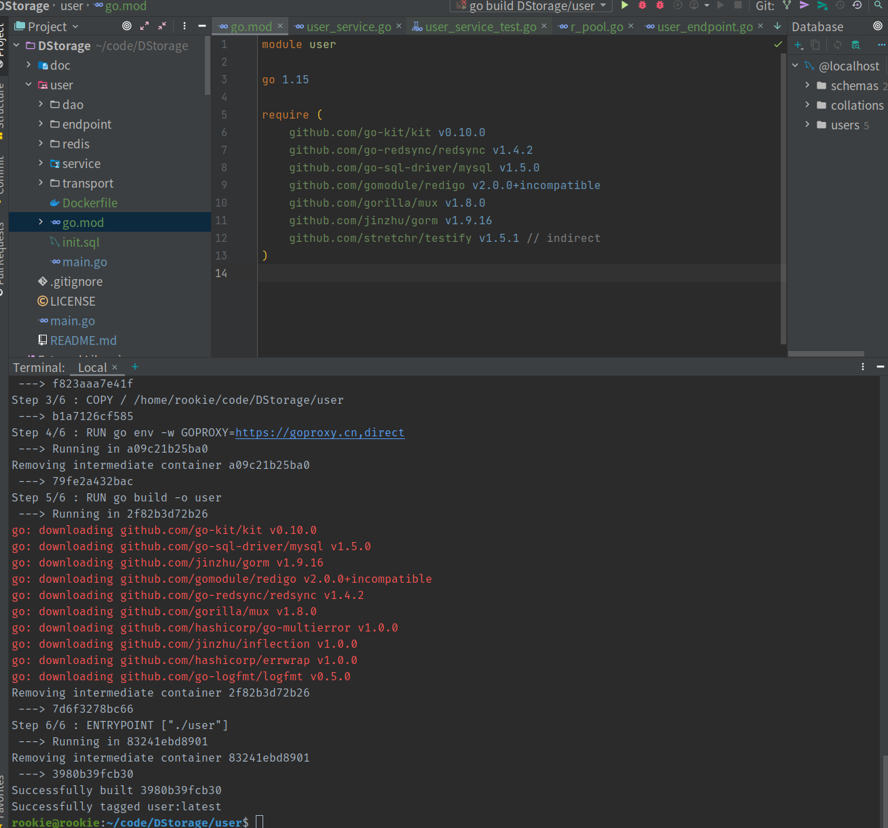

# Docker部署
### 使用go mod docker 打包
- 在对应的目录下 ，这里 user目录下  执行
```shell
# 生成 user mod
go mod init
```
- 随后 执行docker命令
```shell
docker build -t user . 
# 权限不足记得加 sudo
# -t 选项用于指定镜像的名称和标签，不指定标签默认为 latest；命令最后的 . 为 Dockerfile 所在的地址。
```
### 初始化MySQL
```shell
docker build -t mysql-for-user . 
docker run  -itd --name mysql-for-user -p 3306:3306 -e MYSQL_ROOT_PASSWORD=123456 mysql-for-user 
# 通过以上命令就构建和启动了 mysql-for-user 镜像，并指定 MySQL 的 root 账户密码为 123456
```

### docker启动Redis
```shell
docker search redis 
docker pull redis:5.0     # 拉取Redis镜像
docker images redis       # 查看本地redis各个镜像有那些版本
docker run -itd --name redis-5.0 -p 6379:6379 redis:5.0   # 启动Redis镜像
# d 选项指定容器以后台方式运行，启动后返回容器的 ID；
# -i 选项让容器的标准输入保持打开，而 -t 选项让 Docker 分配一个伪终端并绑定到容器的标准输入上，这两个选项一般配合使用；
# --name 指令用以指定容器名，要求每个容器都不一样； 命名冲突记得改后面 redis-5.0 
# -p 指令将容器的 6379 端口映射到宿主机的 6379 端口，在外部我们可以直接通过宿主机6379 端口访问 Redis
```


### 镜像打包太大？
- 因为拉取的linux 一般是Latest 所以特别大，这里使用alpha 即可


## Dockerfile 文件解析
- user
- 如图所示问价目录格式

```dockerfile
FROM golang:latest
WORKDIR /home/rookie/code/DStorage/user          
COPY / /home/rookie/code/DStorage/user
RUN go env -w GOPROXY=https://goproxy.cn,direct
RUN go build -o user
ENTRYPOINT ["./user"]
# From：Dockerfile 中必须出现的第一个指令，用于指定基础镜像，在上述例子中我们指定了基础镜像为 golang:latest 版本。
# WORKDIR：指定工作目录，之后的命令将会在该目录下执行。
# COPY：将本地文件添加到容器指定位置中。
# RUN：创建镜像执行的命令，一个 Dockerfile 可以有多个 RUN 命令。在上述 RUN 指令中我们指定了 Go 的代理，并通过 go build 构建了 user 服务。
# ENTRYPOINT：容器被启动后执行的命令，每个 Dockerfile 只有一个。我们通过该命令在容器启动后，又启动了 user 服务。
```
- mysql
```dockerfile
FROM mysql:5.7
WORKDIR /docker-entrypoint-initdb.d
ENV LANG=C.UTF-8
COPY init.sql .
# MySQL 的官方镜像支持在容器启动的时候自动执行指定的 sql 脚本或者 shell 脚本，
# 只要在构建容器时将相关 sql 脚本或者 shell 脚本复制到 /docker-entrypoint-initdb.d 目录下即可。
# 比如上述例子中，我们把初始化 init.sql 放到该目录下，让容器在启动时帮我们初始化好 user 数据库。
```
